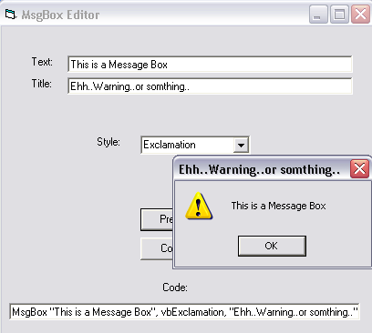



## \_MsgBox Creator\_

### Description

This is a MsgBox creation program I made to help complete beginners with Message Box's. There used to be an aplication that came with VB 4 or 5that did somthing similar.
 
### More Info
 

             |
---                |---
**Submitted On**   |2002-11-22 17:58:12
**By**             |[Gary Boyd](https://github.com/Planet-Source-Code/PSCIndex/blob/master/ByAuthor/gary-boyd.md)
**Level**          |Beginner
**User Rating**    |4.9 (44 globes from 9 users)
**Compatibility**  |VB 6\.0
**Category**       |[Miscellaneous](https://github.com/Planet-Source-Code/PSCIndex/blob/master/ByCategory/miscellaneous__1-1.md)
**World**          |[Visual Basic](https://github.com/Planet-Source-Code/PSCIndex/blob/master/ByWorld/visual-basic.md)
**Archive File**   |[\_MsgBox\_Cr15020611222002\.zip](https://github.com/Planet-Source-Code/gary-boyd-msgbox-creator__1-40973/archive/master.zip)

